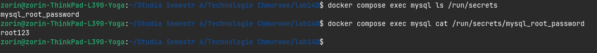
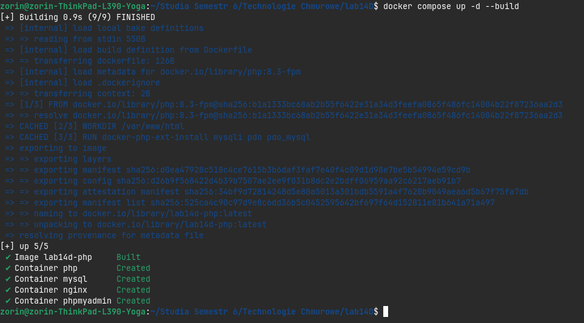
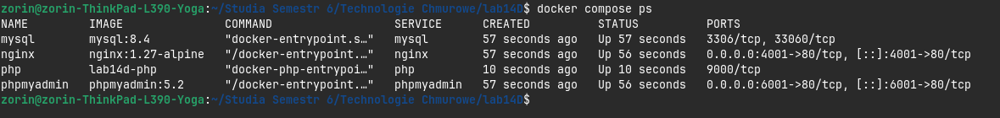
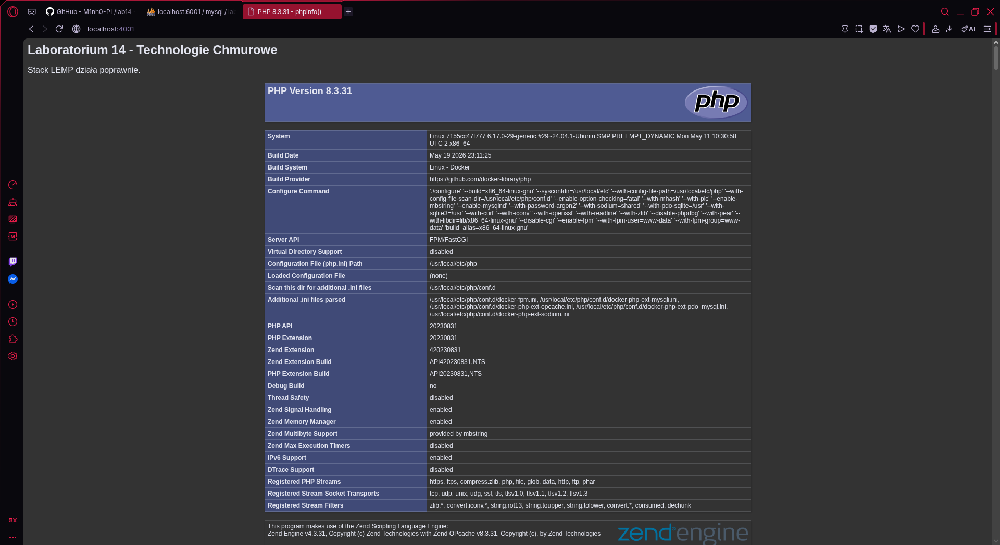
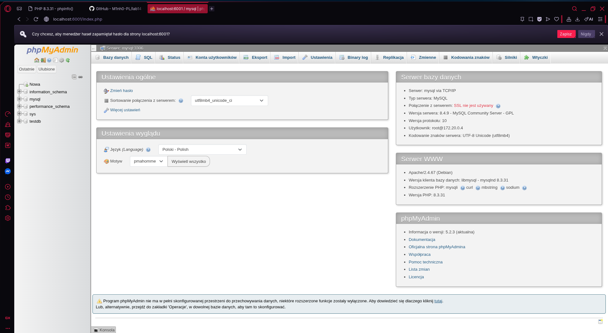
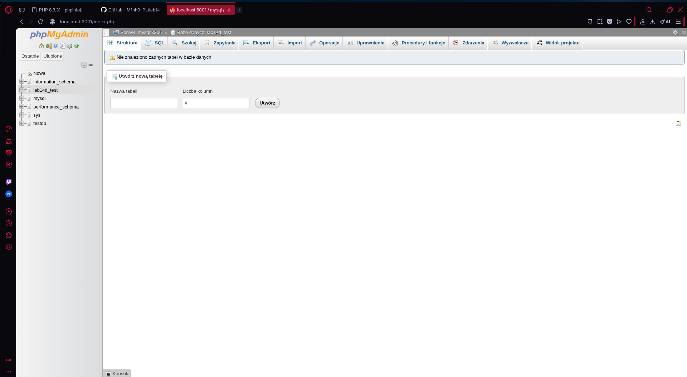

# Laboratorium 14D – Stack LEMP z Docker Secrets

**Autor:** Ireneusz Witek

## Cel zadania

Celem zadania było przygotowanie środowiska LEMP (Linux, Nginx, MySQL, PHP) uruchamianego za pomocą Docker Compose oraz wykorzystanie mechanizmu Docker Secrets do bezpiecznego przechowywania hasła administratora bazy danych.


## Wykorzystanie Docker Secrets

Hasło administratora MySQL nie zostało zapisane bezpośrednio w pliku docker-compose.yml.

Zamiast tego wykorzystano mechanizm Docker Secrets.

Utworzony został sekret: `mysql_root_password`, 
który został zamontowany w kontenerze MySQL pod ścieżką:
```text
/run/secrets/mysql_root_password
```

Weryfikacja działania:
```bash
docker compose exec mysql ls /run/secrets
```

Odczyt wartości sekretu:
```bash
docker compose exec mysql cat /run/secrets/mysql_root_password
```

---

## Uruchomienie środowiska

Budowa i uruchomienie wszystkich usług:

```bash
docker compose up -d --build
```




Sprawdzenie stanu kontenerów:

```bash
docker compose ps
```



---

## Działanie stosu LEMP


Strona została udostępniona przez serwer Nginx na porcie:

```text
http://localhost:4001
```

Po wejściu na stronę wyświetlana jest aplikacja PHP oraz informacje generowane przez funkcję:

```php
phpinfo();
```

Potwierdza to poprawne działanie:

- Nginx,
- PHP-FPM,
- komunikacji pomiędzy kontenerami.


---

## Dostęp do phpMyAdmin

phpMyAdmin został udostępniony na porcie:

```text
http://localhost:6001
```

Dane logowania:

```text
Host: mysql
Użytkownik: root
Hasło: root123
```

Po zalogowaniu możliwe jest zarządzanie bazą danych MySQL.



---

## Inicjalizacja testowej bazy danych

Po zalogowaniu do phpMyAdmin utworzono bazę danych: `lab14d_test`

Operacja zakończyła się powodzeniem, co potwierdza poprawną współpracę:

- phpMyAdmin,
- MySQL,
- sieci backend.



---

## Wnioski

Przygotowany stos LEMP działa poprawnie.
Zapewniono komunikację pomiędzy usługami za pomocą sieci Docker oraz wykorzystano mechanizm Docker Secrets do bezpiecznego przechowywania hasła administratora bazy danych. Możliwe jest wyświetlenie aplikacji PHP, logowanie do phpMyAdmin oraz tworzenie nowych baz danych.
